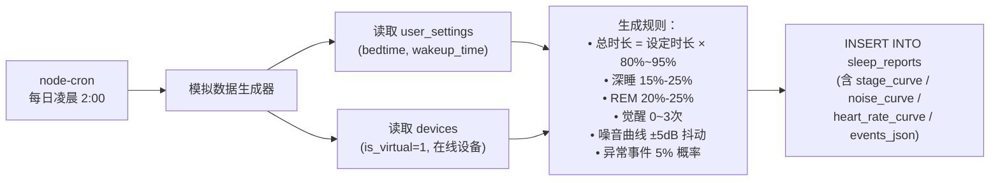

# 智能睡眠环境调控设备 — 数据库设计

> 基于《智能睡眠环境调控设备-软件系统功能需求(实训需求)》§5 数据结构设计章节。
> 数据库引擎：SQLite（实训阶段），字段设计遵循文档原文定义，类型由 MySQL 映射至 SQLite。

---

## 一、Mermaid ER 图

```mermaid
erDiagram
    users {
        INTEGER user_id PK "主键，自增，用户唯一标识"
        TEXT phone UK "手机号，NOT NULL，11位"
        TEXT nickname "用户昵称，最长50字符，默认'用户'"
        TEXT avatar_url "头像URL，可空"
        INTEGER gender "性别：0未知 1男 2女，默认0"
        INTEGER birth_year "出生年份，4位数字"
        INTEGER role "角色：0普通用户 1医生 2管理员，默认0"
        INTEGER status "账户状态：0正常 1禁用，默认0"
        TEXT created_at "注册时间，默认当前时间"
    }

    devices {
        TEXT device_id PK "设备唯一序列号，32字符，虚拟设备格式VIR+16位随机"
        INTEGER user_id FK "当前绑定用户ID → users.user_id，可空表示未绑定"
        TEXT device_name "用户自定义设备昵称，默认'我的设备'"
        INTEGER is_virtual "是否虚拟设备：1虚拟 0真实硬件，默认0"
        TEXT firmware_version "固件版本号，默认'V1.0.0'"
        TEXT last_active_time "设备最后活跃时间，虚拟设备每日自动更新"
        TEXT created_at "首次添加到系统的时间"
    }

    sleep_reports {
        INTEGER report_id PK "主键，自增，报告唯一标识"
        INTEGER user_id FK "所属用户ID → users.user_id"
        TEXT device_id FK "产生此报告的设备ID → devices.device_id"
        TEXT report_date "报告日期 yyyy-MM-dd，与user_id组成唯一"
        INTEGER sleep_score "睡眠综合评分 0-100，默认0"
        INTEGER total_minutes "总睡眠时长（分钟），默认0"
        INTEGER deep_minutes "深睡时长（分钟），占比15%-25%，默认0"
        INTEGER rem_minutes "REM时长（分钟），占比20%-25%，默认0"
        INTEGER light_minutes "浅睡时长（分钟），占比45%-55%，默认0"
        INTEGER wake_minutes "夜间清醒总时长（分钟），默认0"
        REAL avg_heart_rate "整夜平均心率 bpm"
        TEXT events_json "异常事件JSON数组"
        TEXT heart_rate_curve "分钟级心率数据JSON数组"
        TEXT respiration_curve "分钟级呼吸频率数据JSON数组"
        TEXT stage_curve "睡眠分期序列JSON数组，每30秒一个值"
        TEXT noise_curve "环境噪音等级曲线JSON数组，每分钟dB"
        TEXT created_at "报告生成时间，默认当前时间"
    }

    user_settings {
        INTEGER user_id PK_FK "用户ID，主键且外键 → users.user_id"
        TEXT bedtime "期望就寝时间，默认'23:00:00'"
        TEXT wakeup_time "期望起床时间，默认'07:00:00'"
        INTEGER sunrise_duration "日出程序时长（分钟）5-30，默认10"
        TEXT sound_preference "助眠音效：white_noise/wave/rain/fire，默认white_noise"
        TEXT wake_sound "唤醒声音：bird/music/nature，默认bird"
        INTEGER preferred_brightness "偏好亮度 1-100，默认50"
        INTEGER preferred_volume "偏好音量 0-100，默认40"
        TEXT device_timezone "设备时区，默认'Asia/Shanghai'"
        INTEGER do_not_disturb_enabled "勿扰模式开关：0关闭 1开启，默认0"
        TEXT dnd_start "勿扰开始时间，默认'23:00:00'"
        TEXT dnd_end "勿扰结束时间，默认'06:00:00'"
        TEXT created_at "设置首次创建时间"
    }

    doctor_authorizations {
        INTEGER id PK "主键，自增，授权记录唯一标识"
        INTEGER patient_user_id FK "患者用户ID → users.user_id"
        INTEGER doctor_user_id FK "医生用户ID → users.user_id"
        TEXT status "状态：pending/active/expired/revoked，默认active"
        TEXT expire_at "授权到期时间"
        TEXT created_at "授权发起时间"
    }

    users ||--o{ devices : "拥有 / 绑定"
    users ||--o{ sleep_reports : "生成"
    users ||--|| user_settings : "配置 1:1"
    users ||--o{ doctor_authorizations : "作为患者发起授权"
    users ||--o{ doctor_authorizations : "作为医生接收授权"
    devices ||--o{ sleep_reports : "采集产生"
```

---

## 二、SQLite DDL 建表语句

```sql
-- ============================================================
-- 启用外键约束（SQLite 默认关闭，需每次连接时执行）
-- ============================================================
PRAGMA foreign_keys = ON;

-- ============================================================
-- 1. 用户表 (users)
-- 来源：需求文档 §5.1
-- ============================================================
CREATE TABLE IF NOT EXISTS users (
    user_id    INTEGER PRIMARY KEY AUTOINCREMENT,  -- 用户唯一标识，自增
    phone      TEXT    NOT NULL UNIQUE,            -- 手机号，11位数字
    nickname   TEXT    NOT NULL DEFAULT '用户',     -- 用户昵称，最长50字符
    avatar_url TEXT,                               -- 头像图片URL
    gender     INTEGER NOT NULL DEFAULT 0,         -- 性别：0=未知 1=男 2=女
    birth_year INTEGER,                            -- 出生年份（4位）
    role       INTEGER NOT NULL DEFAULT 0,         -- 角色：0=普通用户 1=医生 2=管理员
    status     INTEGER NOT NULL DEFAULT 0,         -- 账户状态：0=正常 1=禁用
    created_at TEXT    NOT NULL DEFAULT (datetime('now','localtime'))
);

-- ============================================================
-- 2. 设备表 (devices)
-- 来源：需求文档 §5.2
-- ============================================================
CREATE TABLE IF NOT EXISTS devices (
    device_id         TEXT    PRIMARY KEY,              -- 设备唯一序列号（VIR+16位随机 OR 硬件出厂编码）
    user_id           INTEGER,                          -- 当前绑定用户ID，NULL=未绑定
    device_name       TEXT    NOT NULL DEFAULT '我的设备', -- 用户自定义设备昵称
    is_virtual        INTEGER NOT NULL DEFAULT 0,       -- 1=虚拟（演示/模拟） 0=真实硬件
    firmware_version  TEXT    NOT NULL DEFAULT 'V1.0.0', -- 当前固件版本号
    last_active_time  TEXT    NOT NULL DEFAULT (datetime('now','localtime')), -- 最后活跃时间
    created_at        TEXT    NOT NULL DEFAULT (datetime('now','localtime')),
    FOREIGN KEY (user_id) REFERENCES users(user_id) ON DELETE SET NULL
);

-- ============================================================
-- 3. 睡眠报告表 (sleep_reports)
-- 来源：需求文档 §5.3
-- ============================================================
CREATE TABLE IF NOT EXISTS sleep_reports (
    report_id        INTEGER PRIMARY KEY AUTOINCREMENT,  -- 报告唯一标识
    user_id          INTEGER NOT NULL,                   -- 所属用户ID
    device_id        TEXT    NOT NULL,                   -- 产生此报告的设备ID
    report_date      TEXT    NOT NULL,                   -- 报告日期 yyyy-MM-dd
    sleep_score      INTEGER NOT NULL DEFAULT 0,         -- 睡眠综合评分 0-100
    total_minutes    INTEGER NOT NULL DEFAULT 0,         -- 总睡眠时长（分钟）= 深睡+浅睡+REM
    deep_minutes     INTEGER NOT NULL DEFAULT 0,         -- 深睡时长（分钟），正常15%-25%
    rem_minutes      INTEGER NOT NULL DEFAULT 0,         -- REM时长（分钟），正常20%-25%
    light_minutes    INTEGER NOT NULL DEFAULT 0,         -- 浅睡时长（分钟），正常45%-55%
    wake_minutes     INTEGER NOT NULL DEFAULT 0,         -- 夜间清醒总时长（分钟）
    avg_heart_rate   REAL,                               -- 整夜平均心率（bpm），正常40-100
    events_json      TEXT,                               -- 异常事件JSON数组
    heart_rate_curve TEXT,                               -- 分钟级心率数据JSON数组
    respiration_curve TEXT,                              -- 分钟级呼吸频率数据JSON数组
    stage_curve      TEXT,                               -- 睡眠分期序列JSON，0=清醒 1=浅睡 2=深睡 3=REM
    noise_curve      TEXT,                               -- 环境噪音等级曲线JSON数组（dB SPL）
    created_at       TEXT    NOT NULL DEFAULT (datetime('now','localtime')),
    FOREIGN KEY (user_id)   REFERENCES users(user_id)   ON DELETE CASCADE,
    FOREIGN KEY (device_id) REFERENCES devices(device_id) ON DELETE CASCADE
);

-- 高频查询：按用户+日期查询每日报告
CREATE UNIQUE INDEX IF NOT EXISTS idx_report_user_date
    ON sleep_reports(user_id, report_date);

-- ============================================================
-- 4. 用户设置表 (user_settings)
-- 来源：需求文档 §5.8
-- ============================================================
CREATE TABLE IF NOT EXISTS user_settings (
    user_id               INTEGER PRIMARY KEY,                -- 用户ID（主键+外键，一对一）
    bedtime               TEXT    NOT NULL DEFAULT '23:00:00', -- 期望就寝时间
    wakeup_time           TEXT    NOT NULL DEFAULT '07:00:00', -- 期望起床时间
    sunrise_duration      INTEGER NOT NULL DEFAULT 10,        -- 日出程序时长（分钟），5-30
    sound_preference      TEXT    NOT NULL DEFAULT 'white_noise', -- 助眠音效：white_noise/wave/rain/fire
    wake_sound            TEXT    NOT NULL DEFAULT 'bird',    -- 唤醒声音：bird/music/nature
    preferred_brightness  INTEGER NOT NULL DEFAULT 50,        -- 偏好亮度 1-100（对应1-300 lux）
    preferred_volume      INTEGER NOT NULL DEFAULT 40,        -- 偏好音量 0-100（0=静音 100=85dB）
    device_timezone       TEXT    NOT NULL DEFAULT 'Asia/Shanghai', -- 设备时区
    do_not_disturb_enabled INTEGER NOT NULL DEFAULT 0,        -- 勿扰模式：0=关闭 1=开启
    dnd_start             TEXT    NOT NULL DEFAULT '23:00:00', -- 勿扰开始时间
    dnd_end               TEXT    NOT NULL DEFAULT '06:00:00', -- 勿扰结束时间
    created_at            TEXT    NOT NULL DEFAULT (datetime('now','localtime')),
    FOREIGN KEY (user_id) REFERENCES users(user_id) ON DELETE CASCADE
);

-- ============================================================
-- 5. 医生授权表 (doctor_authorizations)
-- 来源：需求文档 §5.7
-- ============================================================
CREATE TABLE IF NOT EXISTS doctor_authorizations (
    id              INTEGER PRIMARY KEY AUTOINCREMENT,  -- 授权记录唯一标识
    patient_user_id INTEGER NOT NULL,                   -- 患者用户ID
    doctor_user_id  INTEGER NOT NULL,                   -- 医生用户ID
    status          TEXT    NOT NULL DEFAULT 'active',  -- 状态：pending/active/expired/revoked
    expire_at       TEXT    NOT NULL,                   -- 授权到期时间（datetime）
    created_at      TEXT    NOT NULL DEFAULT (datetime('now','localtime')),
    FOREIGN KEY (patient_user_id) REFERENCES users(user_id) ON DELETE CASCADE,
    FOREIGN KEY (doctor_user_id)  REFERENCES users(user_id) ON DELETE CASCADE
);

-- 查询某患者的所有授权 / 某医生的所有患者
CREATE INDEX IF NOT EXISTS idx_auth_patient ON doctor_authorizations(patient_user_id);
CREATE INDEX IF NOT EXISTS idx_auth_doctor  ON doctor_authorizations(doctor_user_id);
CREATE INDEX IF NOT EXISTS idx_auth_status  ON doctor_authorizations(status);
```

---

## 三、字段说明（中文注释）

### 3.1 users（用户表）

| 字段 | 类型 | 约束 | 说明 |
|------|------|------|------|
| `user_id` | INTEGER | PK, AUTOINCREMENT | 用户唯一标识，系统自动生成 |
| `phone` | TEXT | NOT NULL, UNIQUE | 手机号码，11 位数字，用于登录和身份识别 |
| `nickname` | TEXT | NOT NULL, DEFAULT '用户' | 用户昵称，可修改，最长 50 字符 |
| `avatar_url` | TEXT | NULL | 头像图片 URL，可为空，默认使用系统头像 |
| `gender` | INTEGER | NOT NULL, DEFAULT 0 | 性别：`0`=未知 `1`=男 `2`=女 |
| `birth_year` | INTEGER | NULL | 出生年份（4 位数字），用于年龄计算和健康分析 |
| `role` | INTEGER | NOT NULL, DEFAULT 0 | 用户角色：`0`=普通用户 `1`=医生 `2`=管理员 |
| `status` | INTEGER | NOT NULL, DEFAULT 0 | 账户状态：`0`=正常 `1`=禁用（禁用后无法登录） |
| `created_at` | TEXT | NOT NULL | 账户注册时间，格式 `yyyy-MM-dd HH:mm:ss` |

### 3.2 devices（设备表）

| 字段 | 类型 | 约束 | 说明 |
|------|------|------|------|
| `device_id` | TEXT | PK | 设备唯一序列号。硬件设备为出厂编码；虚拟设备格式 `VIR`+16 位随机字符 |
| `user_id` | INTEGER | FK → users.user_id, NULL | 当前绑定用户的 ID，`NULL` 表示设备未绑定 |
| `device_name` | TEXT | NOT NULL, DEFAULT '我的设备' | 用户自定义的设备昵称，用于列表中显示 |
| `is_virtual` | INTEGER | NOT NULL, DEFAULT 0 | `1`=虚拟设备（演示/模拟），`0`=真实硬件 |
| `firmware_version` | TEXT | NOT NULL, DEFAULT 'V1.0.0' | 设备当前固件版本号，格式如 `V1.0.0` |
| `last_active_time` | TEXT | NOT NULL | 设备最后活跃时间。真实设备上报心跳；虚拟设备每日自动更新 |
| `created_at` | TEXT | NOT NULL | 设备首次添加到系统的时间 |

### 3.3 sleep_reports（睡眠报告表）

| 字段 | 类型 | 约束 | 说明 |
|------|------|------|------|
| `report_id` | INTEGER | PK, AUTOINCREMENT | 睡眠报告唯一标识 |
| `user_id` | INTEGER | FK → users.user_id, NOT NULL | 所属用户 ID |
| `device_id` | TEXT | FK → devices.device_id, NOT NULL | 产生此报告的设备 ID |
| `report_date` | TEXT | NOT NULL | 报告对应夜晚日期（`yyyy-MM-dd`），与 `user_id` 组成唯一索引 |
| `sleep_score` | INTEGER | NOT NULL, DEFAULT 0 | 综合睡眠评分 0-100，越高越好。依据：时长、深睡比例、觉醒次数等 |
| `total_minutes` | INTEGER | NOT NULL, DEFAULT 0 | 总睡眠时长（分钟）= 深睡 + 浅睡 + REM，不含清醒时间 |
| `deep_minutes` | INTEGER | NOT NULL, DEFAULT 0 | 深睡时长（分钟），正常成人占比 15%-25% |
| `rem_minutes` | INTEGER | NOT NULL, DEFAULT 0 | 快速眼动睡眠时长（分钟），正常成人占比 20%-25% |
| `light_minutes` | INTEGER | NOT NULL, DEFAULT 0 | 浅睡时长（分钟），正常成人占比 45%-55% |
| `wake_minutes` | INTEGER | NOT NULL, DEFAULT 0 | 夜间总清醒时长（分钟），含入睡潜伏期和夜间觉醒 |
| `avg_heart_rate` | REAL | NULL | 整夜平均心率（次/分钟），正常静息范围 40-100 bpm |
| `events_json` | TEXT | NULL | 异常事件列表，JSON 数组。每项含 `type`（apnea/limb_movement/wake）、`time`、`duration` |
| `heart_rate_curve` | TEXT | NULL | 分钟级心率数据，JSON 数组 `[75,74,72,...]`，长度 = 总睡眠分钟数 |
| `respiration_curve` | TEXT | NULL | 分钟级呼吸频率数据，JSON 数组 `[16,15,14,...]` |
| `stage_curve` | TEXT | NULL | 睡眠分期序列，每 30 秒一个值，编码：`0`=清醒 `1`=浅睡 `2`=深睡 `3`=REM |
| `noise_curve` | TEXT | NULL | 环境噪音等级曲线，分钟级 JSON 数组，单位 dB SPL，`[35,36,34,...]` |
| `created_at` | TEXT | NOT NULL | 报告生成时间（通常是第二天凌晨） |

### 3.4 user_settings（用户设置表）

| 字段 | 类型 | 约束 | 说明 |
|------|------|------|------|
| `user_id` | INTEGER | PK + FK → users.user_id | 用户 ID，主键，一对一关联 |
| `bedtime` | TEXT | NOT NULL, DEFAULT '23:00:00' | 期望就寝时间，用于模拟数据生成和后续唤醒定时 |
| `wakeup_time` | TEXT | NOT NULL, DEFAULT '07:00:00' | 期望起床时间，用于模拟数据生成和后续唤醒定时 |
| `sunrise_duration` | INTEGER | NOT NULL, DEFAULT 10 | 日出程序时长（分钟），范围 5-30，用于晨间缓慢唤醒 |
| `sound_preference` | TEXT | NOT NULL, DEFAULT 'white_noise' | 助眠音效类型：`white_noise`（白噪音）`wave`（海浪）`rain`（雨声）`fire`（篝火） |
| `wake_sound` | TEXT | NOT NULL, DEFAULT 'bird' | 唤醒声音类型：`bird`（鸟鸣）`music`（轻柔音乐）`nature`（自然音） |
| `preferred_brightness` | INTEGER | NOT NULL, DEFAULT 50 | 偏好亮度等级 1-100（对应 1-300 lux），仅存储无实际控制 |
| `preferred_volume` | INTEGER | NOT NULL, DEFAULT 40 | 偏好音量等级 0-100（0=静音 100=85dB SPL） |
| `device_timezone` | TEXT | NOT NULL, DEFAULT 'Asia/Shanghai' | 设备时区，影响报告日期显示和模拟数据生成时间 |
| `do_not_disturb_enabled` | INTEGER | NOT NULL, DEFAULT 0 | 勿扰模式开关：`0`=关闭 `1`=开启 |
| `dnd_start` | TEXT | NOT NULL, DEFAULT '23:00:00' | 勿扰开始时间，时段内不推送任何通知 |
| `dnd_end` | TEXT | NOT NULL, DEFAULT '06:00:00' | 勿扰结束时间 |
| `created_at` | TEXT | NOT NULL | 设置首次创建时间 |

### 3.5 doctor_authorizations（医生授权表）

| 字段 | 类型 | 约束 | 说明 |
|------|------|------|------|
| `id` | INTEGER | PK, AUTOINCREMENT | 授权记录唯一标识 |
| `patient_user_id` | INTEGER | FK → users.user_id, NOT NULL | 患者用户 ID（数据所有者） |
| `doctor_user_id` | INTEGER | FK → users.user_id, NOT NULL | 医生用户 ID（被授权者） |
| `status` | TEXT | NOT NULL, DEFAULT 'active' | 授权状态：`active`（有效期内）`expired`（已过期）`revoked`（患者已撤销） |
| `expire_at` | TEXT | NOT NULL | 授权到期时间，过期后医生无法查看数据 |
| `created_at` | TEXT | NOT NULL | 授权发起时间 |

---

## 四、表关系速查

```
users ──── 1:1 ──── user_settings         （user_id）
users ──── 1:N ──── devices               （user_id, 允许 NULL = 未绑定）
users ──── 1:N ──── sleep_reports         （user_id）
users ──── 1:N ──── doctor_authorizations  （patient_user_id）
users ──── 1:N ──── doctor_authorizations  （doctor_user_id）
devices ── 1:N ──── sleep_reports         （device_id）
```

| 关系 | 基数 | 外键策略 |
|------|------|----------|
| 用户 → 设置 | 1:1 | `user_settings.user_id` PK+FK，ON DELETE CASCADE |
| 用户 → 设备 | 1:N | `devices.user_id` FK，ON DELETE SET NULL（解绑后保留设备记录） |
| 用户 → 报告 | 1:N | `sleep_reports.user_id` FK，ON DELETE CASCADE |
| 设备 → 报告 | 1:N | `sleep_reports.device_id` FK，ON DELETE CASCADE（设备删除时级联删除报告） |
| 用户 → 授权(患者) | 1:N | `doctor_authorizations.patient_user_id` FK，ON DELETE CASCADE |
| 用户 → 授权(医生) | 1:N | `doctor_authorizations.doctor_user_id` FK，ON DELETE CASCADE |

---

## 五、模拟数据生成器与表的关系



---

## 六、与需求文档的差异说明

| 项目 | 需求文档 (§5) | 本设计 (SQLite) | 原因 |
|------|-------------|----------------|------|
| 主键类型 | `bigint` | `INTEGER` | SQLite 整型统一 |
| 自增语法 | `AUTO_INCREMENT` | `AUTOINCREMENT` | SQLite 语法 |
| 字符串 | `varchar(n)` | `TEXT` | SQLite 无定长类型 |
| 布尔 | `boolean` | `INTEGER (0/1)` | SQLite 无布尔类型 |
| 日期时间 | `datetime` / `date` / `time` | `TEXT` (ISO 格式) | SQLite 无原生日期类型，用 TEXT 存储 |
| 枚举 | `enum(...)` | `TEXT` + 文档约束 | SQLite 无枚举，在应用层校验 |
| 定点小数 | `decimal(5,2)` | `REAL` | SQLite 浮点替代 |
| 默认值 `CURRENT_TIMESTAMP` | MySQL 函数 | `datetime('now','localtime')` | SQLite 等效函数 |
| devices 主键 | `varchar(32)` | `TEXT PRIMARY KEY` | 等价；文档用 device_id 作为自然主键 |
| user_settings 主键 | `user_id` (PK+FK) | 同，`INTEGER PRIMARY KEY` | 一致；文档即用 user_id 作 PK |
| doctor_authorizations 状态 | `enum('pending',...'revoked')` | `TEXT` DEFAULT 'active' | MVP 阶段简化，用户发起即 active，无需医生确认步骤 |

> **说明**：文档原文还有 `sleep_diary`（睡眠日记）、`questionnaire_results`（量表结果）、`sleep_restriction_log`（睡眠限制打卡）、`firmware_versions`（OTA 固件版本）4 张表，属于 e-CBTi 专区和 OTA 模块，不在本次 MVP 5 张核心表范围内，后续迭代时补充。
