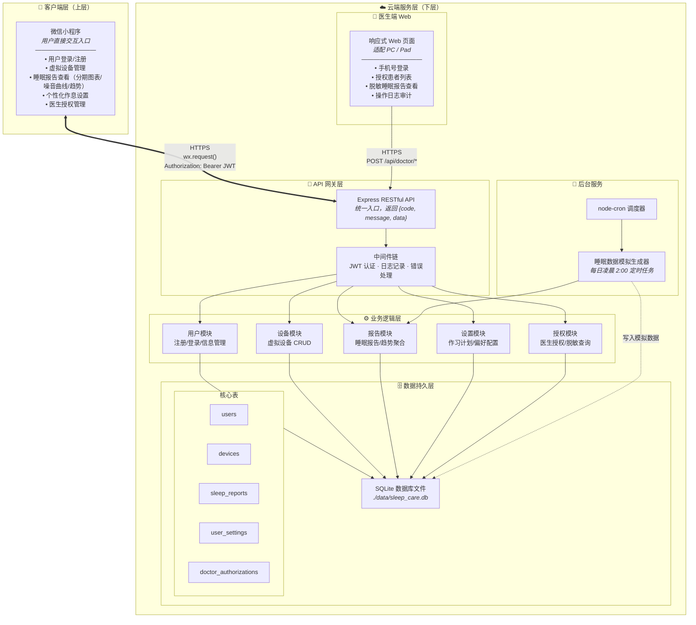
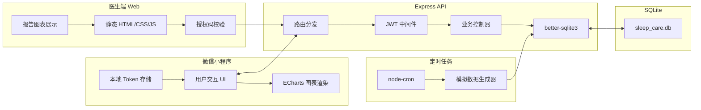
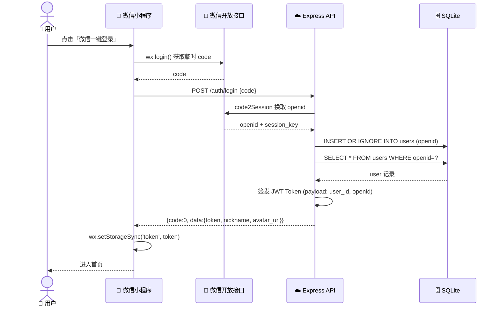
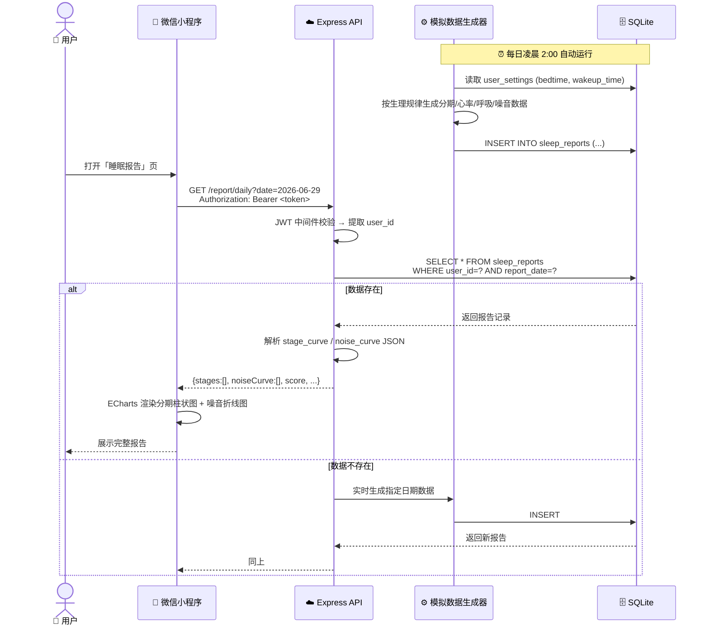
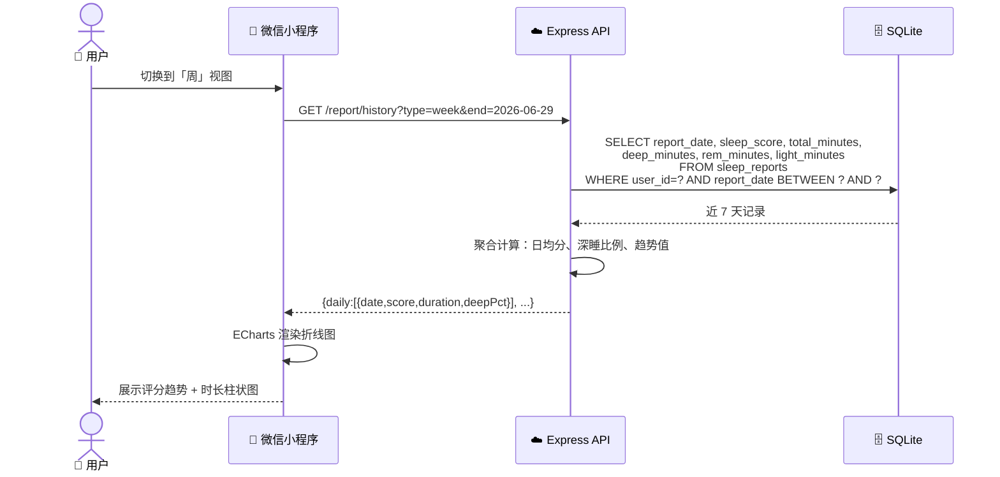
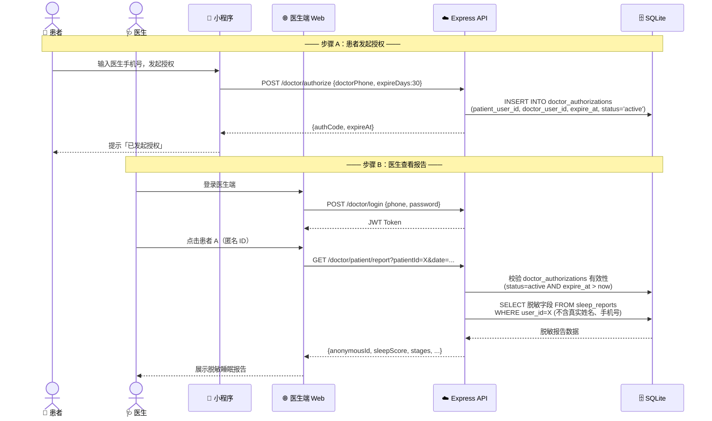
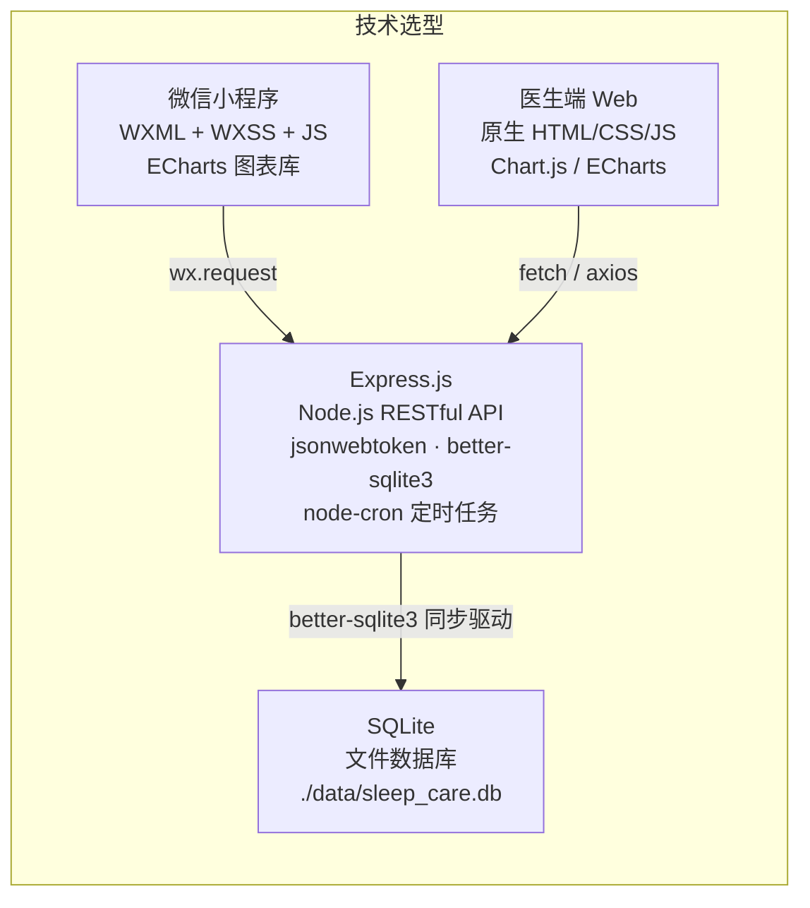
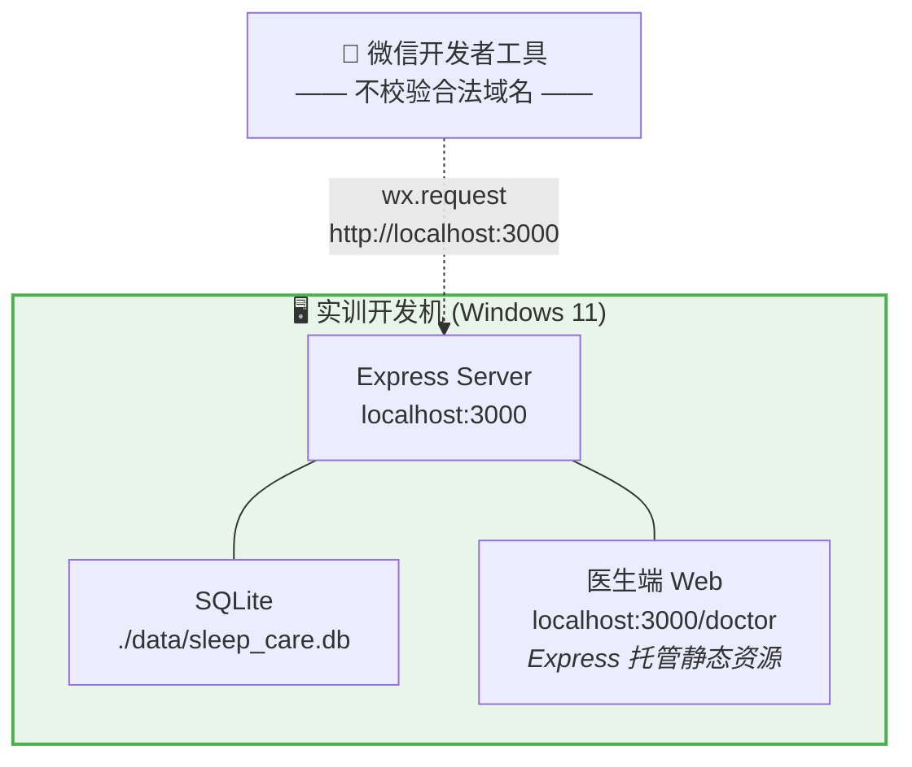

# 智能睡眠环境调控设备 — 系统架构图

> 基于《智能睡眠环境调控设备-软件系统功能需求(实训需求)》§2 系统总体架构描述。
> 实训阶段不依赖真实硬件，所有设备数据与调控指令均使用模拟数据。

---

## 一、系统分层架构

---

## 二、组件职责速览

---

## 三、请求数据流向（典型场景）

### 场景 1：用户登录

### 场景 2：睡眠报告查看（含模拟数据生成）

### 场景 3：周趋势查询

### 场景 4：医生授权 → 查看脱敏报告

---

## 四、技术栈映射

---

## 五、实训阶段部署拓扑

> **说明**：实训阶段所有服务集中部署在同一台开发机上。微信小程序通过开发者工具的「不校验合法域名」选项直连本地 `localhost:3000` API；医生端 Web 页面作为 Express 静态资源托管，无需额外启动 Web 服务器。后续正式上线时，仅需将 Express 部署到云服务器、SQLite 替换为 MySQL/PostgreSQL、配置 HTTPS 域名白名单即可。
